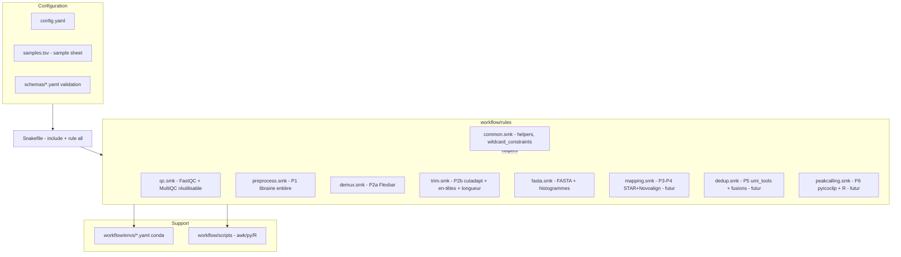
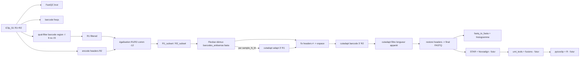

# optiCLIP — Audit, Architecture cible & Plan de développement

> Livrable des **Phases 1 à 3** de la migration du pipeline Bash `draft_code/raw_bash/script.txt`
> vers un workflow Snakemake modulaire. **Aucune ligne de logique scientifique n'est modifiée
> à ce stade.** L'implémentation (Phase 4) est conditionnée à la validation de ce document.

---

## Phase 1 — Audit de l'existant

### 1.1 Nature du pipeline

Le script implémente un pipeline **iCLIP / CLIP-seq en paired-end** (« optiCLIP ») sur données
humaines (GRCh38.p14 / GENCODE v44). Il part d'**une seule librairie multiplexée** (`iClip_S1`,
R1+R2) et va jusqu'au **peak-calling** et à la visualisation. La numérotation d'origine du script
ne comporte que deux étapes (`1. Quality control`, `2. Demultiplexing…`), mais le
fichier contient en réalité **six grandes phases** :

| # | Phase | Lignes | Rôle |
|---|-------|--------|------|
| P1 | Contrôle qualité & prétraitement | 8–94 | FastQC, encodage des en-têtes, fréquences de barcodes, filtrage qualité de la région barcode, égalisation R1/R2 |
| P2 | Démultiplexage + trimming | 101–531 | Flexbar (démux), cutadapt (adaptateur 3′ R1, barcode 3′ R2), filtre de longueur, conversion FASTA, histogrammes |
| P3 | Mapping génomique | 535–587 | STAR (index + alignement) puis Novoalign (récupération des non-mappés) |
| P4 | Fusion des alignements | 590–670 | tri, `samtools merge` STAR+Novoalign, tri |
| P5 | Déduplication & fusions | 673–790 | `umi_tools dedup`, fusion barcodes→échantillon→condition, `bamtobed` |
| P6 | Peak-calling & viz | 793–912 | pyicoclip (Python 2), conversion GTF, R/ggplot histogrammes de longueur de pics |

### 1.2 Structure des lectures (read structure)

R1 5′ porte : **UMI1 (5 nt) + barcode expérimental (6 nt) + UMI2 (4 nt) = 15 nt** de région
technique, suivie de l'insert. Cette structure explique les longueurs `-l 6` (barcode seul) et
`-l 15` (UMI+barcode+UMI) du filtrage qualité, et les adaptateurs R2 de forme `NNNN<barcode>NNNNN`.

### 1.3 Étapes détaillées, E/S, intermédiaires

**P1 — QC & prétraitement** (opère sur la librairie entière, *pas* encore par échantillon) :
- `fastqc` sur R1 et R2 bruts → `outdir_R1/`, `outdir_R2/`.
- Encodage des en-têtes R2 : `sed 's/ /#/g; s/\//#/g'` → `iClip_S1_R2_002.fastq.gz`. But : préserver
  l'information d'en-tête à travers des outils qui coupent aux espaces.
- Fréquences de barcodes : `awk` extrait les positions 6–11 (barcode 6 nt après UMI1 de 5 nt),
  `sort | uniq -c` → `exp_barcodes_R1.detected` (diagnostic).
- Filtrage qualité de la région barcode : `fastx_trimmer -f 1 -l {6|15}` → `fastq_quality_filter -q 10 -p 100`
  → liste d'IDs → `seqtk subseq` → `iClip_S1_R1_001.filtered.fastq.gz`.
- Égalisation R1/R2 : extraction des IDs, `comm -12` (intersection), ré-suffixage `#1:N:0:1` / `#2:N:0:1`,
  `seqtk subseq` → `R1_subset.fastq.gz`, `R2_subset.fastq.gz` (+ FastQC `outdir_new/`).

**P2 — Démultiplexage & trimming** (fan-out : 1 librairie → 20 fichiers = 10 échantillons × 2 barcodes) :
- `flexbar` : démux sur `barcodes_antisense.fasta`, `--barcode-trim-end LTAIL --barcode-error-rate 0
  --min-read-length 10 --umi-tags` → `flexbarOut_barcode_sample{N}_{M}_{1,2}.fastq.gz`.
- `cutadapt -a AGATCGGAAGAGCGGTTCAG` sur R1 → `output_…`.
- Correction d'en-tête `#1→ 1` / `#2→ 2` (cutadapt ne gère pas `#`) → `output1_…`, `flexbarOut1_…`.
- `cutadapt -a NNNN<barcode>NNNNN` sur R2 (barcode spécifique par échantillon) → `trimmed_…`.
- Filtre de longueur apparié `cutadapt --pair-filter=any --minimum-length=10` → `final1_…`.
- Restauration des en-têtes `#` → `final_…` (livrables FASTQ propres par échantillon).
- `fastq_to_fasta` → `.fasta.gz` + `fasta_clipping_histogram.pl` → `*.readlength.png`.
- Cas particulier **échantillon 11** : ses deux barcodes sont concaténés au niveau FASTQ (`cat`).

**P3–P6** (mapping → peaks) : STAR (index `genomeGenerate` puis `alignReads`, non-mappés en Fastx),
Novoalign sur les non-mappés, `samtools sort/merge` (STAR+Novoalign), `umi_tools dedup --paired
--method unique --extract-umi-method read_id`, fusions barcode→échantillon→condition
(**control = 1-5 ; KD = 8-12**), `bedtools bamtobed`, `pyicos extend 50`, `pyicoclip --p-value 0.01`,
puis R/ggplot.

### 1.4 Paramètres clés (à externaliser en config)

| Paramètre | Valeur | Étape |
|-----------|--------|-------|
| UMI1 / barcode / UMI2 | 5 / 6 / 4 nt | P1 |
| Longueur QC région barcode | **6 nt (Option A)** *ou* **15 nt (Option B)** | P1 |
| Seuil qualité / pourcentage | `-q 10 -p 100` | P1 |
| Adaptateur 3′ R1 | `AGATCGGAAGAGCGGTTCAG` | P2 |
| Adaptateurs 3′ R2 | `NNNN<barcode>NNNNN` (par éch.) | P2 |
| Longueur min. lecture | 10 nt | P2 |
| Barcodes échantillons | ATCACG, CGATGT, … (indices TruSeq) | P2 |
| Génome / annotation | GRCh38.p14 / GENCODE v44 | P3 |
| STAR | `--outFilterMismatchNoverReadLmax 0.04 --outFilterMultimapNmax 1 --alignEndsType Extend5pOfRead1 --sjdbOverhang 84` | P3 |
| Novoalign | `-t 85 -l 15 -r A 10` | P3 |
| Extension pics / p-value | 50 / 0.01 | P6 |
| Conditions | control={1,2,3,4,5}, KD={8,9,10,11,12} | P5 |

### 1.5 Outils externes & versions

FastQC, FASTX-Toolkit (`fastx_trimmer`, `fastq_quality_filter`, `fastq_to_fasta`,
`fasta_clipping_histogram.pl`), seqtk, Flexbar (`--umi-tags`), cutadapt, STAR (`--sjdbOverhang 84`),
Novoalign+novoindex (**propriétaire, licence requise**), samtools, UMI-tools, bedtools, gffread,
pyicoclip/pyicos (**Python 2 uniquement**), R + ggplot2. **Aucune version n'est épinglée dans le
script** → à figer dans les environnements conda.

### 1.6 Points faibles

1. **Duplication massive** : ~800 lignes = la même commande copiée-collée 10–20 fois par étape
   (uniquement l'ID d'échantillon change). Non maintenable, source d'erreurs.
2. **Chemins absolus codés en dur** (`/media/fabrizio/0c22…/`, `/home/fabrizio/novocraft`) → non portable.
3. **Aucune gestion d'erreurs** : pas de `set -euo pipefail`, `mkdir` sans `-p`, échecs silencieux.
4. **Collision d'outputs — Option A vs B** : les deux écrivent `iClip_S1_R1_001.filtered.fastq.gz`
   → exécuté tel quel, **B écrase A** (choix scientifique implicite, non documenté).
5. **Bug latent `cat *.fastq.gz`** (éch. 11, l.523/528) : concaténer des gzip donne un flux valide
   mais fragile ; à surveiller (fonctionne car gzip est concaténable, mais non idiomatique).
6. **Pas de reproductibilité** : versions non figées, pas d'environnement isolé, ordre implicite.
7. **Pas de parallélisme géré** : threads codés en dur (`--runThreadN 8`, `-@ 4`), non pilotables.
8. **Pas de séparation config / code / résultats** ; intermédiaires jamais nettoyés.
9. **Mélange de langages** dans un même fichier (Bash + bloc R non exécutable tel quel).
10. **Mapping échantillon↔barcode↔condition implicite** (dispersé dans les commandes).

### 1.7 Améliorations recommandées

Externaliser tous les paramètres et le mapping échantillon/barcode/condition dans une **sample
sheet + config.yaml** ; remplacer la duplication par des **wildcards** ; isoler chaque outil dans
un **environnement conda épinglé** ; ajouter **logs, benchmarks, `temp()`, ressources** ; supprimer
les chemins absolus ; documenter explicitement le choix Option A/B ; agréger le QC via **MultiQC**.

---

## Phase 2 — Architecture cible

### 2.1 Diagramme d'architecture (modules)



### 2.2 Diagramme du workflow (DAG scientifique)



### 2.3 Organisation des dossiers (cible)

```text
snakemake_wf/
├── Snakefile                     # configfile, include des .smk, rule all
├── config/
│   ├── config.yaml               # paramètres globaux + refs génome
│   ├── samples.tsv               # sample_id, group, barcode_seq, r2_adapter, condition
│   └── barcodes_antisense.fasta  # (ou généré depuis samples.tsv)
├── workflow/
│   ├── rules/  common.smk qc.smk preprocess.smk demux.smk trim.smk fasta.smk
│   │           mapping.smk dedup.smk peakcalling.smk
│   ├── scripts/ barcode_freq.awk  fix_headers.py  equalize_reads.sh  peak_hist.R
│   ├── envs/   fastqc.yaml fastx.yaml flexbar.yaml cutadapt.yaml seqtk.yaml
│   │           star.yaml novoalign.yaml samtools.yaml umitools.yaml bedtools.yaml
│   │           pyicoclip.yaml r-viz.yaml multiqc.yaml
│   └── schemas/ config.schema.yaml  samples.schema.yaml
├── profiles/local/config.yaml  profiles/slurm/config.yaml
├── resources/                    # génome, index (non versionnés)
└── results/ qc/ preprocess/ demux/ trim/ fasta/ mapping/ dedup/ peaks/ logs/
```

### 2.4 Règles à créer (Phase 4 — périmètre prétraitement P1+P2)

| Rule | Module | In → Out | Wildcards | Ressources |
|------|--------|----------|-----------|------------|
| `fastqc_raw` | qc | fastq → html/zip | `{read}` | 1 thread |
| `encode_headers_r2` | preprocess | R2 → R2_encoded | — | 1 |
| `barcode_frequencies` | preprocess | R1 → `.detected` | — | 1 |
| `qualfilter_barcode_region` | preprocess | R1 → filtered | — | 1 |
| `equalize_reads` | preprocess | filtered+R2enc → subsets | — | 1 |
| `flexbar_demux` | demux | subsets → N fichiers/sample | — (fan-out) | threads |
| `cutadapt_r1_adapter` | trim | R1 → output | `{sample}` | threads |
| `fix_headers_encode` | trim | fastq → output1/flexbar1 | `{sample}{read}` | 1 |
| `cutadapt_r2_barcode` | trim | R2 → trimmed | `{sample}` | threads |
| `cutadapt_length_filter` | trim | R1+R2 → final1 (paire) | `{sample}` | threads |
| `restore_headers` | trim | final1 → final | `{sample}{read}` | 1 |
| `fastq_to_fasta` + `readlength_hist` | fasta | final → fasta+png | `{sample}{read}` | 1 |
| `multiqc` | qc | tous FastQC → rapport | — | 1 |

`mapping.smk`, `dedup.smk`, `peakcalling.smk` sont **scaffoldés (stubs documentés)** mais non
activés tant que le périmètre n'est pas étendu (voir 2.11).

### 2.5 Stratégie de gestion des paramètres

Deux niveaux : **`config.yaml`** (paramètres globaux : longueurs UMI/barcode, seuils qualité,
adaptateurs, refs génome, flag Option A/B, threads par défaut) et **`samples.tsv`** (une ligne par
`sample_N_M` : groupe, séquence barcode, adaptateur R2, condition). Chargement centralisé dans
`common.smk` via `pandas`, validé par `schemas/*.yaml`. **Zéro valeur codée en dur** dans les règles.

### 2.6 Environnements (Conda/Mamba)

Un `envs/*.yaml` **par outil**, versions épinglées, référencés par `conda:` dans chaque règle
(exécution avec `--use-conda --conda-frontend mamba`). Cas particuliers documentés :
**pyicoclip → env Python 2 dédié** ; **Novoalign → propriétaire** (installation manuelle + licence,
non redistribuable via conda). Garantit la reproductibilité.

### 2.7 Logging

Chaque règle possède une directive `log:` (`results/logs/{rule}/{wildcards}.log`), `stdout`+`stderr`
redirigés. `benchmark:` optionnel pour le profilage. **MultiQC** agrège les FastQC de tous les stades.

### 2.8 Fichiers temporaires

Marquage `temp()` sur tous les intermédiaires non livrables (`output_`, `output1_`, `flexbarOut1_`,
`trimmed_`, `final1_`, IDs de lecture, `.sam`, BAM non triés). Livrables conservés : FASTQ `final_`,
FASTA, rapports QC, (plus tard) BAM dédupliqués, pics.

### 2.9 Règles de nommage

- Modules : `snake_case.smk` par phase. Règles : verbe_objet (`cutadapt_r1_adapter`).
- Wildcards : `{sample}` = `N_M` (groupe_barcode), `{read}` ∈ {1,2}, `{group}` = N, `{condition}`.
- `wildcard_constraints` stricts (`sample=r"\d+_\d+"`, `read=r"[12]"`) pour lever l'ambiguïté.
- Sorties sous `results/<stage>/…`, logs sous `results/logs/<rule>/…`.

### 2.10 Comparaison d'architectures (justification)

| Décision | Option A | Option B | **Retenu** |
|----------|----------|----------|-----------|
| Découpage modules | 1 module/commande (très fin) | **1 module/phase** | **B** — atomicité sans éparpillement |
| Démux Flexbar | `checkpoint` (liste data-driven) | **rule à sorties énumérées depuis samples.tsv** | **B** — le set d'échantillons est connu *a priori* → DAG déterministe, plus simple |
| Fix en-têtes `#` | règle sed inline | **script `fix_headers.py` réutilisable** | **B** — testable, sans surprise d'échappement |
| Option A/B QC barcode | deux règles distinctes | **une règle paramétrée (`barcode_qc_length`)** | **B** — supprime la collision d'outputs, choix explicite |

### 2.11 Extension aux étapes futures (2 & 3)

Les modules `mapping.smk` / `dedup.smk` / `peakcalling.smk` sont prévus dès la conception : mêmes
conventions (wildcards `{sample}`/`{group}`/`{condition}`, `temp()`, `log:`, envs conda). Les refs
génome (STAR index, GTF) et les groupes de conditions sont déjà dans `config.yaml`/`samples.tsv`.
Activer une phase future = ajouter son `include` + étendre `rule all`. Aucun refactor du cœur requis.

---

## Phase 3 — Plan de développement

### 3.1 Tâches, ordre, dépendances

| # | Tâche | Dépend de | Risque |
|---|-------|-----------|--------|
| T0 | Créer `samples.tsv` + `config.yaml` + schémas + `common.smk` (chargement) | — | Moyen (mapping barcode↔condition à confirmer) |
| T1 | Envs conda épinglés (fastqc, fastx, seqtk, flexbar, cutadapt, multiqc) | T0 | Faible |
| T2 | `qc.smk` (FastQC générique + MultiQC) | T0,T1 | Faible |
| T3 | `preprocess.smk` (P1) + `scripts/` (headers, barcode freq, égalisation) | T0,T1 | Moyen (parité `sed`/`comm` exacte) |
| T4 | `demux.smk` (Flexbar, sorties énumérées) | T3 | **Élevé** (nommage de sortie Flexbar à vérifier sur données) |
| T5 | `trim.smk` (cutadapt R1/R2, en-têtes, longueur) + cas éch. 11 | T4 | Moyen |
| T6 | `fasta.smk` (FASTA + histogrammes) | T5 | Faible |
| T7 | Scaffold `mapping/dedup/peakcalling.smk` (stubs documentés) | T0 | Faible |
| T8 | Validation E2E : `--dry-run`, `--dag`, jeu réduit, comparaison aux sorties Bash | T2–T6 | Moyen |
| T9 | Doc (`README`, docstrings de règles) | tout | Faible |

### 3.2 Risques techniques

- **Nommage de sortie Flexbar** (dépend de la version et du contenu de `barcodes_antisense.fasta`,
  absent du dépôt) → à ancrer sur les fichiers réels avant d'énumérer les outputs.
- **Parité byte-exacte** du prétraitement (`sed`, `comm -12`, `LC_ALL=C`, ré-suffixage d'IDs) →
  encapsuler tel quel dans des scripts, tester la sortie contre le Bash.
- **Option A vs B** : choix scientifique à trancher (change les résultats).
- **Novoalign** (licence) et **pyicoclip** (Python 2) : reproductibilité partielle.
- Compatibilité **Linux** requise (le dev se fait sous Windows) → exécution cible WSL/Linux.

### 3.3 Points nécessitant validation avant implémentation

1. **Périmètre** de cette itération (prétraitement seul P1+P2, ou pipeline complet).
2. **Option A (6 nt) vs Option B (15 nt)** pour le QC de la région barcode.
3. **Sample sheet** : liste échantillons (1-5, 8-12), mapping barcode→séquence→condition, cas éch. 11.
4. Fourniture de **`barcodes_antisense.fasta`** (ou génération depuis la sample sheet).

### 3.4 Vérification (Phase 4)

`snakemake --use-conda -n` (dry-run), `snakemake --dag | dot` (DAG), exécution sur sous-échantillon,
puis **comparaison des sorties** (FASTQ/FASTA `final_`, comptes de lectures) avec celles du script
Bash de référence pour garantir la préservation stricte des résultats.
