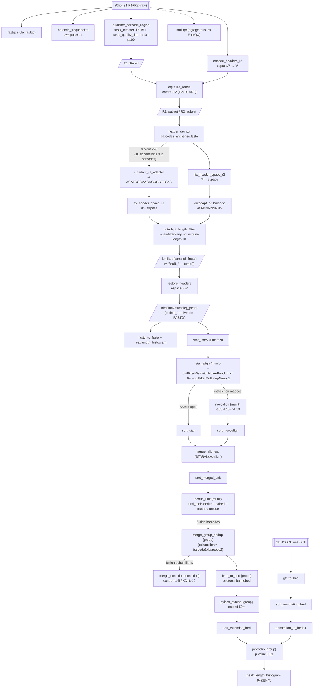
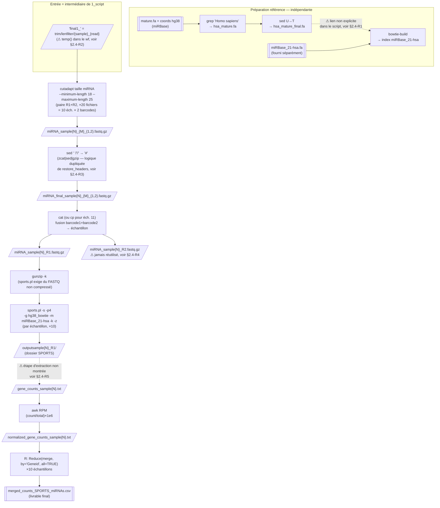

# optiCLIP — Schéma UML étape par étape : `1_script` (déjà migré) & `2_script_miRNA` (nouveau)

> Complète [`01_audit_architecture_plan.md`](01_audit_architecture_plan.md). Ce document ne ré-audite
> pas `1_script` (déjà fait) : il en résume le flux **tel qu'implémenté aujourd'hui** dans
> `workflow/rules/*.smk` (toutes les phases P1–P6 sont maintenant codées, pas seulement scaffoldées),
> puis livre un **audit neuf** de `2_script_miRNA.txt` (jamais documenté ni migré), avec le même
> niveau de détail (étapes, entrées/sorties, paramètres, points faibles).

---

## 1. `1_script` → workflow Snakemake (état actuel, résumé)

Diagramme d'activité UML (Mermaid `flowchart`), annoté avec les **règles réellement implémentées**
(vérifiées dans `workflow/rules/mapping.smk`, `dedup.smk`, `peakcalling.smk` — au-delà de ce que
`01_audit...md` §2.4 décrivait comme « futur/stub »).

### Table récapitulative E/S par phase

| Phase | Règles Snakemake | Entrée | Sortie | Outils |
|---|---|---|---|---|
| P1 QC/prétraitement | `fastqc`, `encode_headers_r2`, `barcode_frequencies`, `qualfilter_barcode_region`, `equalize_reads` | FASTQ brut librairie entière | `R1_subset`/`R2_subset` + rapports FastQC | FastQC, FASTX-Toolkit, seqtk, `comm` |
| P2 Démux + trim | `flexbar_demux`, `cutadapt_r1_adapter`, `fix_header_space_{r1,r2}`, `cutadapt_r2_barcode`, `cutadapt_length_filter`, `restore_headers` | subsets | `trim/final/{sample}_{read}.fastq.gz` (livrable) — intermédiaire clé : `trim/lenfilter/{sample}_{read}.fastq.gz` (**temp()**, avant restauration des `#`) | Flexbar, cutadapt |
| P2b FASTA/QC | `fastq_to_fasta`, `readlength_histogram` | `trim/final/*` | `.fasta.gz`, histogrammes longueur | FASTX-Toolkit, Perl |
| P3 Mapping | `star_index`, `star_align`, `novoindex`, `novoalign`, `sort_star`, `sort_novoalign`, `merge_aligners`, `sort_merged_unit` | `trim/final/*` + génome/GTF | `mapping/merged/{munit}.sorted.bam` | STAR, Novoalign, samtools |
| P4 Dedup + fusions | `dedup_unit`, `merge_group_dedup`, `merge_condition`, `bam_to_bed` | BAM mergé par unité | `dedup/group/{group}.dedup.bed` (peak-calling) + `dedup/condition/{condition}.sorted.{bam,sam}` (branche annexe) | UMI-tools, samtools, bedtools |
| P5 Annotation | `gtf_to_bed`, `sort_annotation_bed`, `annotation_to_bedpk` | GTF GENCODE v44 | `annotation.bedpk` | gffread/awk, sort |
| P6 Peak-calling | `pyicos_extend`, `sort_extended_bed`, `pyicoclip`, `peak_length_histogram` | `.dedup.bed` (P4) + `.bedpk` (P5) | `{group}.genome_sorted.pk`, `{group}.peaklength.pdf` | pyicos/pyicoclip (Py2), R/ggplot |

**Constat par rapport à `01_audit...md`** : ce document décrivait mapping/dedup/peakcalling comme
« scaffoldés, non activés ». Ils sont en réalité **pleinement implémentés** (33 règles au total,
9 modules). Le README du wf est à jour sur ce point (« goes from a single multiplexed library to
per-sample CLIP peaks »).

---

## 2. `2_script_miRNA.txt` — audit neuf (non migré, non documenté)

### 2.1 Nature

Post-traitement du **même prétraitement iCLIP** (réutilise les sorties de `1_script`) pour profiler
les **petits ARN non codants** (miRNA matures) via **SPORTS1.1** (Shi et al. 2018), avec sélection de
taille, ré-annotation par Bowtie/miRBase 21, puis normalisation RPM et fusion en une matrice
d'expression multi-échantillons.

### 2.2 Diagramme d'activité UML

### 2.3 Table détaillée E/S par étape

| # | Étape | Commande / outil | Entrée | Sortie | Fan-out |
|---|---|---|---|---|---|
| A1 | Filtrage espèce | `grep -A1 "Homo sapiens"` | `mature.fa` (miRBase) | `hsa_mature.fa` | 1× |
| A2 | Conversion alphabet | `sed 's/U/T/g'` | `hsa_mature.fa` | `hsa_mature_final.fa` | 1× |
| A3 | Index Bowtie miRNA | `bowtie-build` | `miRBase_21-hsa.fa` | index `miRBase_21-hsa.*` | 1× |
| B | Sélection de taille miRNA | `cutadapt --minimum-length 18 --maximum-length 25` | `final1_flexbarOut_barcode_sample{N}_{M}_{1,2}.fastq.gz` (= `trim/lenfilter/...` du wf) | `miRNA_sample{N}_{M}_{1,2}.fastq.gz` | ×20 (10 éch. × 2 barcodes, éch. 11 = 1 seul) |
| C | Restauration en-têtes | `zcat \| sed 's/ /#/g; s/\//#/g' \| gzip` | `miRNA_sample{N}_{M}_{read}.fastq.gz` | `miRNA_final_sample{N}_{M}_{read}.fastq.gz` | ×20 |
| D | Fusion barcodes → échantillon | `cat` (`cp` pour éch. 11) | `miRNA_final_sample{N}_{1,2}_{read}.fastq.gz` | `miRNA_sample{N}_R{1,2}.fastq.gz` | ×10 échantillons × 2 reads |
| E | Décompression | `gunzip -k` | `miRNA_sample{N}_R1.fastq.gz` | `miRNA_sample{N}_R1.fastq` | ×10 (**R1 seulement**) |
| F | Annotation SPORTS | `sports.pl -s -p 4 -g <hg38> -m <miRBase_21-hsa> -k -z` | `miRNA_sample{N}_R1.fastq` + index génome/miRBase | `outputsample{N}_R1/` (contient `gene_counts_sample{N}.txt`, non montré) | ×10 échantillons |
| G | Normalisation RPM | `awk` (2 passes : somme puis ratio ×1e6) | `gene_counts_sample{N}.txt` | `normalized_gene_counts_sample{N}.txt` | ×10 |
| H | Fusion inter-échantillons | R `Reduce(merge, by="Geneid", all=TRUE)` + `write.csv` | 10× `normalized_gene_counts_sample{N}.txt` | `merged_counts_SPORTS_miRNAs.csv` | 1× |

**Échantillons traités** : 1,2,3,4,5,8,9,10,11,12 — identique à `1_script` (control = 1‑5, KD =
8‑12). Échantillon 11 conserve son statut particulier (un seul barcode, cf. `merge_before_mapping`
dans `1_script`).

### 2.4 Points d'attention (audit bioinformaticien, à trancher avant migration)

1. **R1 — Chaîne de référence miRNA ambiguë.** `hsa_mature_final.fa` (mature.fa filtré + U→T) est
   généré mais **jamais référencé** dans la suite du script ; l'index Bowtie utilisé par `sports.pl`
   (`miRBase_21-hsa`) est construit à partir d'un fichier `miRBase_21-hsa.fa` distinct, obtenu hors
   script (commentaire : « new index based on mature.fa, old stored as stemloop »). Il est probable
   que `hsa_mature_final.fa` **soit** en réalité renommé/copié en `miRBase_21-hsa.fa` avant le
   `bowtie-build`, mais cette étape n'est pas tracée. **À clarifier avec l'auteur avant d'automatiser.**
2. **R2 — Dépendance à un fichier `temp()` du workflow.** L'entrée de l'étape B
   (`final1_flexbarOut_barcode_...`) correspond à `results/trim/lenfilter/{sample}_{read}.fastq.gz`,
   marqué `temp()` dans `trim.smk` et aujourd'hui consommé uniquement par `restore_headers`. Si le
   module miRNA est ajouté comme règle Snakemake normale, Snakemake retardera la suppression
   jusqu'à ce que les deux consommateurs aient tourné (pas de perte) — mais si le script miRNA reste
   un **script Bash externe lancé après coup**, le fichier aura déjà été nettoyé. → migrer en règle
   Snakemake, pas en post-traitement détaché.
3. **R3 — Logique dupliquée.** L'étape C réimplémente manuellement la restauration d'en-têtes déjà
   encapsulée dans la règle `restore_headers` de `1_script`. À factoriser (même script/règle
   paramétrée) plutôt que redupliquer le `sed`.
4. **R4 — Branche R2 morte.** L'étape D fusionne aussi les R2 (`miRNA_sample{N}_R2.fastq.gz`), mais
   `sports.pl` tourne en mode `-s` (single-end, R1 uniquement) : **les fichiers R2 fusionnés ne sont
   jamais consommés**. Calcul/E-S inutiles à supprimer en migration (économie de temps + espace
   disque), sauf besoin futur non documenté.
5. **R5 — Étape manquante/implicite.** Le passage de `outputsample{N}_R1/` (sortie brute SPORTS) à
   `gene_counts_sample{N}.txt` n'apparaît pas dans le script : SPORTS produit plusieurs fichiers par
   catégorie de RNA (miRNA, tRNA, rRNA, piRNA…) sous des noms propres à l'outil — une extraction /
   renommage du fichier miRNA a dû être faite manuellement. **À documenter explicitement** (nom exact
   du fichier SPORTS source) avant d'écrire une règle Snakemake.
6. **Mêmes faiblesses structurelles que `1_script`** : ~180 lignes dupliquées (echantillon en dur au
   lieu de wildcards), chemins absolus (`/home/fabrizio/...`), pas de `set -euo pipefail`, aucune
   version d'outil épinglée, pas de logs/benchmarks, `PATH` modifié en dur en plein script.
7. **Dépendances externes** : SPORTS1.1 (Python2/Perl, install manuelle `export PATH=...`), Bowtie1
   (`bowtie-build`, pas Bowtie2 malgré le chemin `bowtie2-2.5.2` dans le `PATH` — **incohérence à
   vérifier** : le binaire réellement appelé, `bowtie-build`, est Bowtie **1**, pas dans ce dossier
   bowtie2), sratoolkit (présent dans le `PATH` mais aucune commande `sra*` utilisée dans ce script —
   résidu probable d'un autre pipeline).

### 2.5 Recommandation de migration (cohérente avec l'architecture existante)

Créer `workflow/rules/mirna.smk`, sur le modèle de `trim.smk`/`peakcalling.smk` : wildcards
`{sample}` (réutilise `UNITS`/`samples.tsv` de `common.smk`), entrée = sortie de
`cutadapt_length_filter` (déclarée explicitement en dépendance, pas en `temp()` orphelin), une règle
par étape (B→H), `env` dédié `sports.yaml` (Python2/Perl) + `bowtie1.yaml`, `log:`/`benchmark:`
systématiques, suppression de la branche R2 (point R4) sauf besoin scientifique confirmé, et
clarification préalable des points R1/R5 avec l'auteur du script avant d'écrire les règles
d'annotation SPORTS.

### 2.6 État de la migration

`workflow/rules/mirna.smk` est écrit (12 règles, une par étape A→H + les deux index Bowtie1),
branche indépendante, câblée dans le `Snakefile` (`include:` + sous-cible `mirna`, volontairement
hors de `all`). R2/R3/R4 sont résolus tels que recommandés ci-dessus (dépendance explicite au
`temp()` de `trim.smk`, `scripts/restore_headers.sh` partagé, branche R2 supprimée). R1 et R5
restent des **hypothèses de modélisation** faute de pouvoir consulter l'auteur : documentées et
justifiées dans les docstrings des règles `mirna_bowtie_index` et `sports_extract_counts`
respectivement — à valider contre une exécution réelle de SPORTS1.1 avant de faire confiance aux
comptages produits. Voir aussi le README du workflow, section « miRNA branch ».
